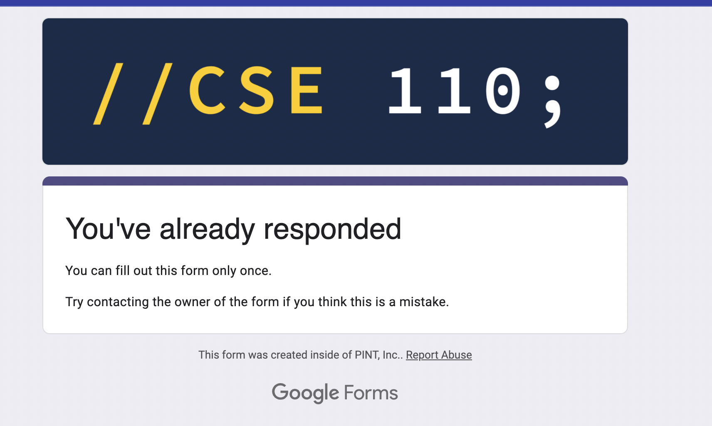

# Introduction to Myself
## As a programmer
I began to learn programming languages in 2019. The first language I learned is *C++* and it was super hard for at that time even now it is still not easy. I found most of the interest when I was learning *HTML* and *CSS* because it is something that can be visually seen by my friends who has no idea of programming, thinking it as something cool.

## As a person
I am a person who likes sports, music, and pets. I have been playing basketball for over fifteen years and I have raised three cats. I love the hiphop culture so much. One of my mottos is 
>Hard work beats talent when talent fails to work.


Here is some code I have learned in this class so far:
```
brew install git
```

This is linked to my Github page[Page Link](https://github.com/scottieboyzhang)

This is a link to a screenshot 

Here is some qualities I think is necessary for becoming successful in programming
- Hardworking
- Collaboration
- Innovation
- Practice
  
Three companies that I like
1. Apple
2. Tesla
3. Facebook

[a link](# As a programmer)

Here are some task lists that I have made so far
- [] Eat breakfast
- [x] Work Out
- [ ] Finish Assignment
